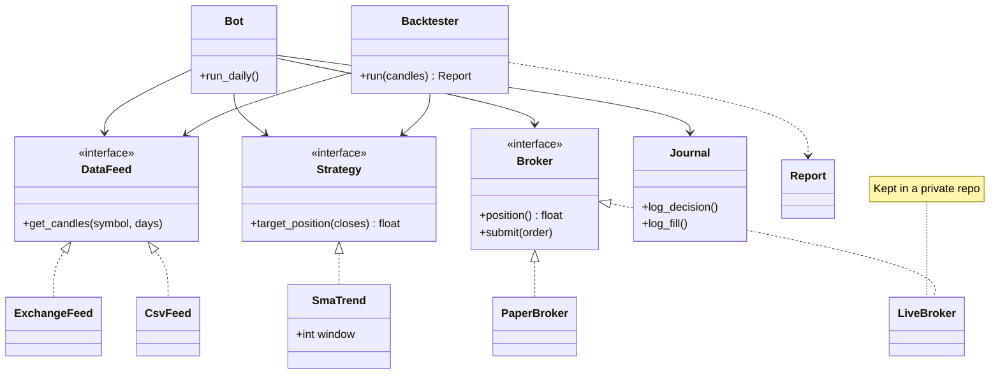

# btc-trend-bot

```mermaid
classDiagram
  direction TB
  class Bot {
    +run_daily()
  }
  class Backtester {
    +run(candles) Report
  }
  class DataFeed {
    <<interface>>
    +get_candles(symbol, days)
  }
  class Strategy {
    <<interface>>
    +target_position(closes) float
  }
  class Broker {
    <<interface>>
    +position() float
    +submit(order)
  }
  class Journal {
    +log_decision()
    +log_fill()
  }
  class ExchangeFeed
  class CsvFeed
  class SmaTrend {
    +int window
  }
  class PaperBroker
  class LiveBroker
  class Report
  Bot --> DataFeed
  Bot --> Strategy
  Bot --> Broker
  Bot --> Journal
  Backtester --> DataFeed
  Backtester --> Strategy
  Backtester ..> Report
  DataFeed <|.. ExchangeFeed
  DataFeed <|.. CsvFeed
  Strategy <|.. SmaTrend
  Broker <|.. PaperBroker
  Broker <|.. LiveBroker
  note for LiveBroker "Kept in a private repo"
```

